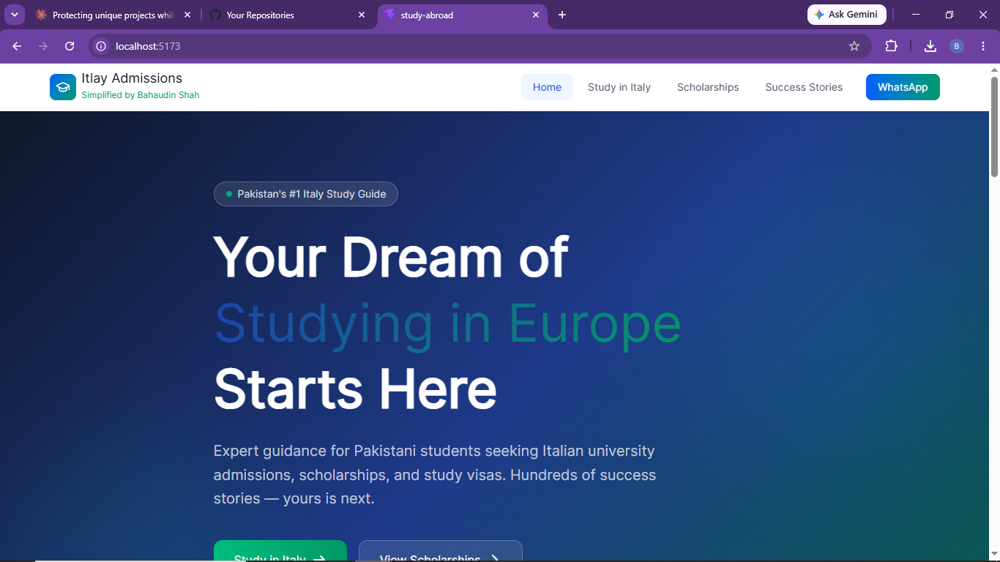
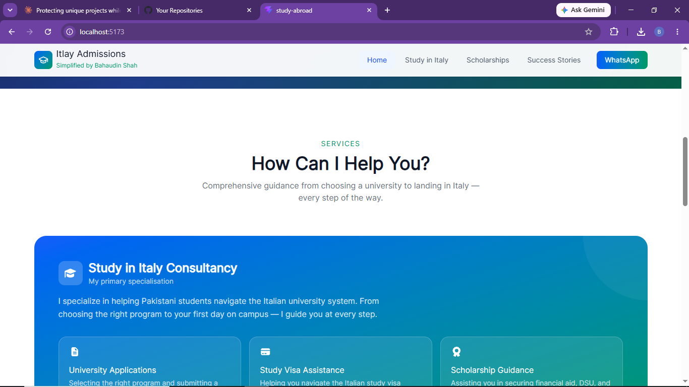
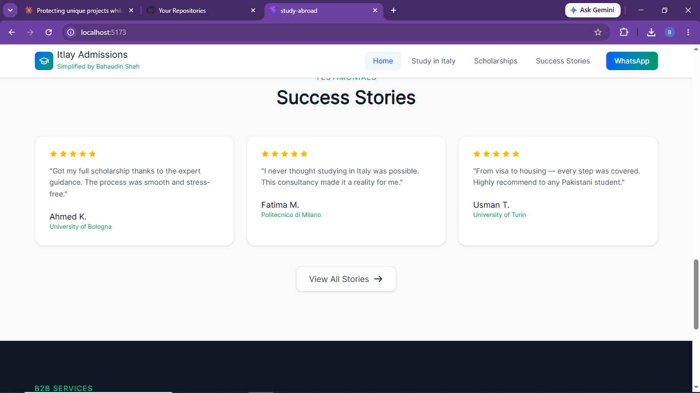
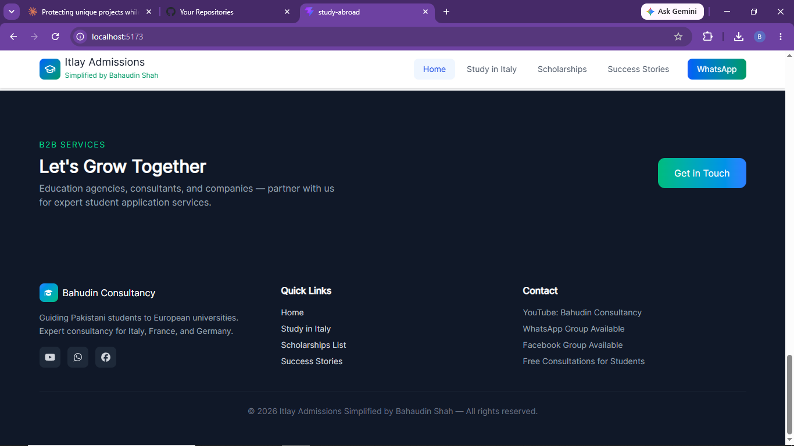
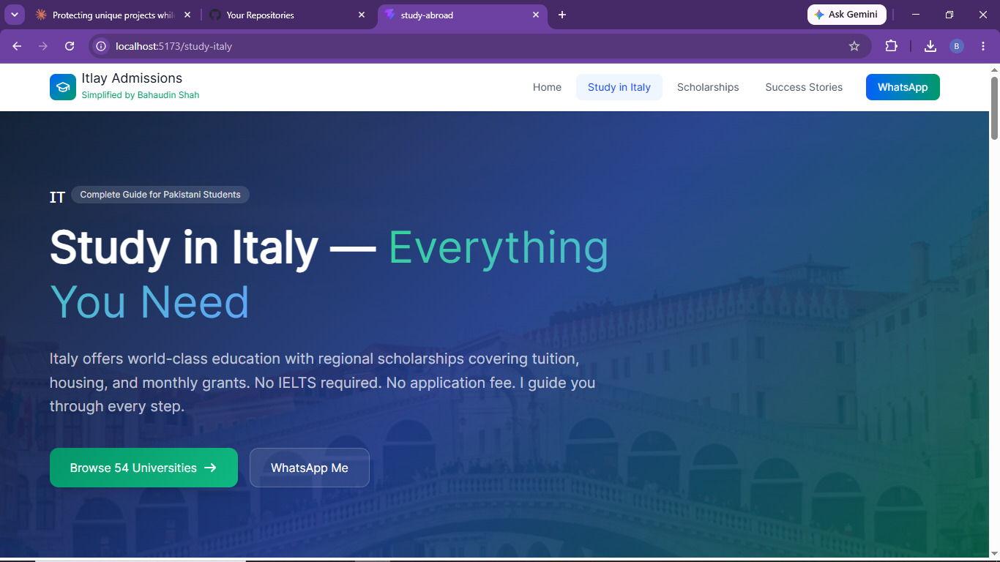
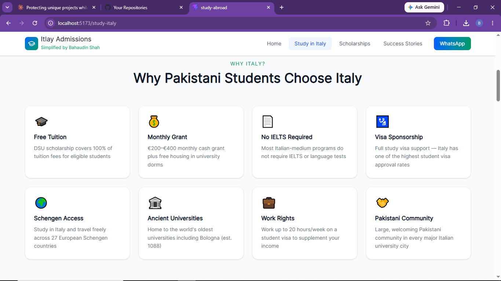
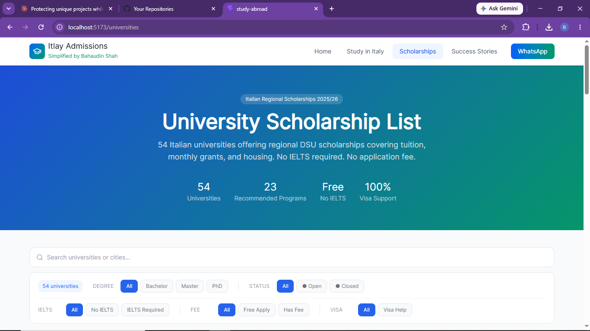
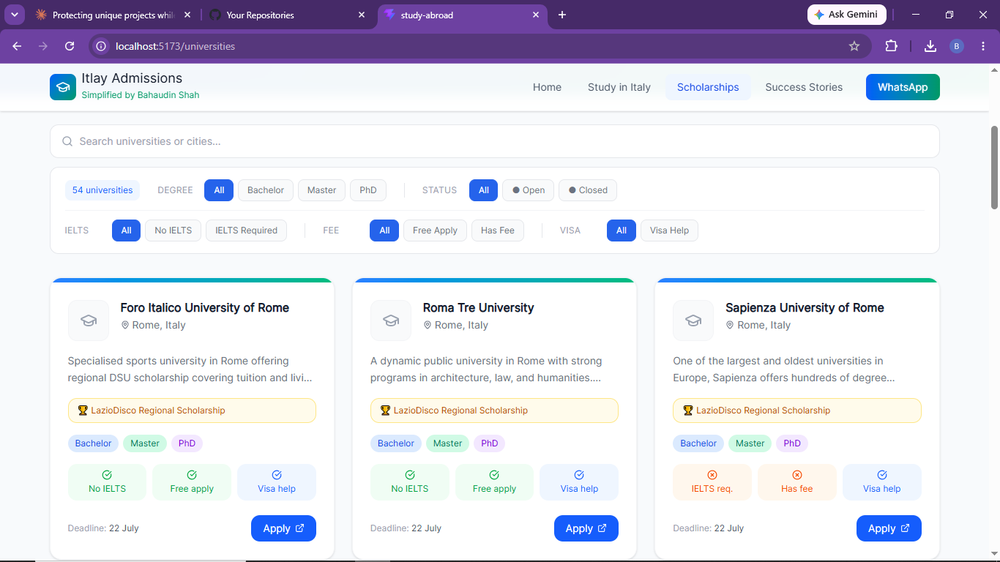
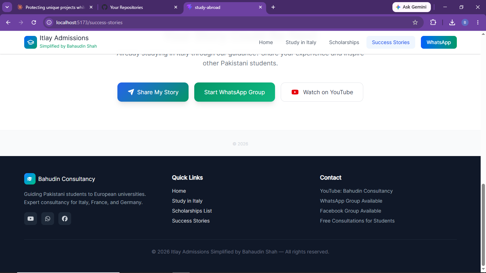

# Study in Italy — Consultancy Website 🇮🇹

A client website built for an education consultancy helping Pakistani students apply to universities in Italy — covering everything from initial guidance to university/scholarship listings.

> This is a **showcase repository** built for a real client. It contains selected screenshots and a project overview. Full source code is kept private out of respect for client confidentiality.

---

## 📖 About

Studying abroad involves navigating unfamiliar university systems, scholarship programs, and application processes. This website was built for an education consultancy to guide Pakistani students specifically toward studying in Italy — presenting the consultancy's services, success stories, and university/scholarship information in one place, with a clear path to consultation.

---

## ✨ Key Features

- **Landing Page** — Clear value proposition ("Your Dream of Studying in Europe Starts Here") with a direct call to action
- **Services Overview** — "How Can I Help You?" section outlining consultation offerings
- **Success Stories** — Testimonial section showcasing past student outcomes with ratings
- **Study in Italy Guide** — Dedicated section covering everything prospective students need to know
- **Why Choose Italy** — Feature grid highlighting the advantages for Pakistani students specifically
- **University & Scholarship Listings** — Searchable/browsable list of universities and available scholarships
- **Contact & Footer** — Consultancy contact details and quick navigation links
- **Call-to-Action Sections** — Multiple conversion points throughout the site to book a consultation

---

## 🛠️ Tech Stack

- **Frontend:** React.js / Next.js *(update to match actual stack)*
- **Styling:** Modern gradient-based UI with teal/blue branding

---

## 🖥️ Screenshots

  
  
  
  

  
  
  
  

  

---

## 👤 Developer

Built by **Buraque** — Founder, CEO @ Youngdev Interns.
Full profile: [github.com/Buraquescode](https://github.com/Buraquescode)
